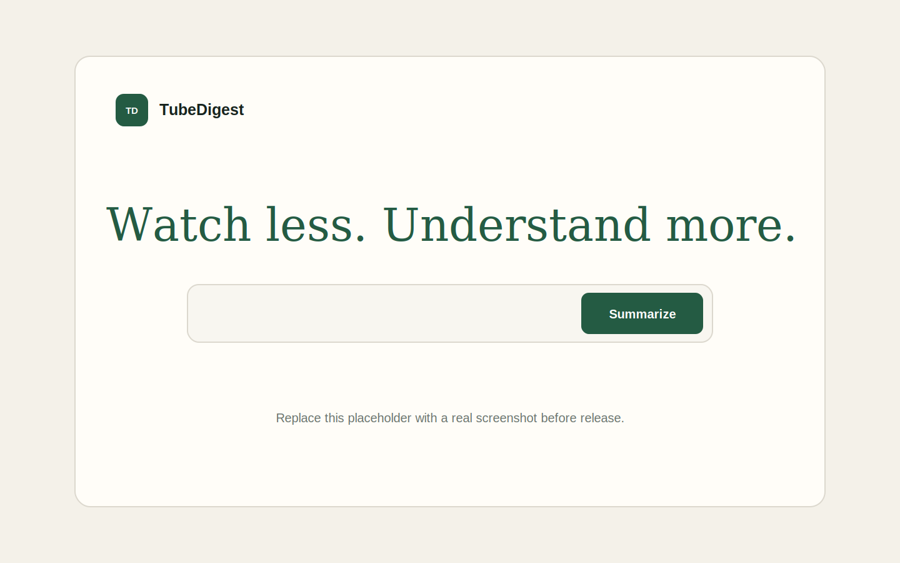

# TubeDigest

TubeDigest is an open-source web app that turns accessible YouTube captions into a structured, full-video text summary. It never downloads video or audio media. The backend discovers available caption tracks, prefers English by default, reconstructs fragmented auto-captions, and produces a grounded summary with free local Ollama, OpenAI, or a basic extractive fallback.

## Features

- Supports `youtube.com/watch`, `youtu.be`, Shorts, embed, mobile, and live URLs
- Discovers manually uploaded and auto-generated caption tracks
- Prefers manual English captions, then auto-generated English, then another available language
- Allows users to choose another available caption language
- Preserves caption timing for timestamped sections
- Cleans duplicate caption artifacts, markup, entities, and whitespace
- Uses hierarchical chunk summaries for long videos
- Uses free local Ollama models without sending transcripts to a cloud AI
- Keeps optional OpenAI credentials exclusively on the backend
- Includes a coherent timed-passage fallback when no AI provider is available
- Caches cleaned transcripts in memory and on disk
- Adds request size limits, strict validation, security headers, CORS controls, and rate limiting
- Provides copy-to-clipboard and text-download actions

## Screenshot



Replace the placeholder with a real application screenshot when publishing the repository.

## Architecture

```text
tubedigest/
├── apps/
│   ├── client/                 # React + Vite frontend
│   │   └── src/
│   └── server/                 # Express API
│       ├── data/cache/         # Runtime transcript cache (gitignored)
│       └── src/
│           └── summarizers/    # Provider-neutral summarizer implementations
├── docs/screenshots/
├── .env.example
├── .github/workflows/ci.yml
├── LICENSE
└── package.json
```

The server fetches the YouTube watch page for a validated 11-character video ID, reads its exposed caption-track metadata, and retrieves the selected timed-caption track through YouTube's player interface. User-provided hosts or caption URLs are never fetched, which prevents the URL field from becoming a general-purpose SSRF primitive.

## Requirements

- Node.js 20 or newer
- npm 10 or newer
- Ollama for free local AI summaries (recommended)
- An OpenAI API key as an optional cloud fallback

## Installation

```powershell
git clone https://github.com/savxzthc/TubeDigest.git
cd tubedigest
npm install
Copy-Item .env.example .env
```

macOS/Linux:

```bash
git clone https://github.com/savxzthc/TubeDigest.git
cd tubedigest
npm install
cp .env.example .env
```

### Recommended: free local AI with Ollama

Install [Ollama](https://ollama.com/download), then download the default lightweight model:

```powershell
ollama pull qwen2.5:1.5b
```

Keep Ollama running and use these `.env` settings:

```dotenv
SUMMARIZER_MODE=auto
OLLAMA_BASE_URL=http://127.0.0.1:11434
OLLAMA_MODEL=qwen2.5:1.5b
```

The first summary can take longer while the model loads. Transcript text stays on your machine.

### Optional: OpenAI

Add an API key to `.env` to use OpenAI when the configured Ollama model is unavailable:

```dotenv
OPENAI_API_KEY=your_api_key_here
OPENAI_MODEL=gpt-5.4-mini
SUMMARIZER_MODE=auto
```

No API key is required. In `auto` mode TubeDigest tries the configured local Ollama model first, then OpenAI when a key is configured, then the basic extractive fallback.

## Run Locally

Start the frontend and backend together:

```bash
npm run dev
```

Open [http://localhost:5173](http://localhost:5173). The API listens on `http://localhost:8787`.

Build both apps and run the production server:

```bash
npm run build
npm start
```

Then open [http://localhost:8787](http://localhost:8787). Express serves the compiled frontend and API from one process.

## Environment Variables

| Variable | Default | Purpose |
| --- | --- | --- |
| `PORT` | `8787` | API and production web server port |
| `CLIENT_ORIGIN` | `http://localhost:5173` | Comma-separated allowed browser origins |
| `OPENAI_API_KEY` | empty | Server-side OpenAI credential |
| `OPENAI_MODEL` | `gpt-5.4-mini` | Configurable Responses API model |
| `OLLAMA_BASE_URL` | `http://127.0.0.1:11434` | Local Ollama API URL |
| `OLLAMA_MODEL` | `qwen2.5:1.5b` | Installed Ollama model used for summaries |
| `OLLAMA_TIMEOUT_MS` | `180000` | Maximum local model generation time |
| `SUMMARIZER_MODE` | `auto` | `auto`, `ollama`, `openai`, or `extractive` |
| `TRANSCRIPT_CACHE_TTL_HOURS` | `24` | Cleaned transcript cache lifetime |
| `RATE_LIMIT_WINDOW_MS` | `60000` | API rate-limit window |
| `RATE_LIMIT_MAX` | `20` | Requests allowed per IP per window |
| `LOG_LEVEL` | `info` | `debug`, `info`, `warn`, or `error` |
| `VITE_API_BASE_URL` | same origin | Optional API URL for separately hosted clients |

Never put secrets in a `VITE_*` variable. Vite embeds those values in browser assets.

## API

### List caption languages

```http
GET /api/transcripts/languages?url=https%3A%2F%2Fyoutu.be%2FVIDEO_ID
```

### Summarize a video

```http
POST /api/summarize
Content-Type: application/json

{
  "url": "https://www.youtube.com/watch?v=VIDEO_ID",
  "language": "en"
}
```

The `language` field is optional. Errors use a consistent shape:

```json
{
  "error": {
    "code": "TRANSCRIPT_UNAVAILABLE",
    "message": "This video has no accessible captions or transcript, so it cannot be summarized.",
    "requestId": "..."
  }
}
```

## Quality Checks

```bash
npm run typecheck
npm test
npm run build
npm audit
```

GitHub Actions runs type checking, tests, a production build, and a production-dependency audit.

## Adding Another AI Provider

Implement the `Summarizer` interface in `apps/server/src/summarizers/summarizer.ts`, then select the implementation in `apps/server/src/summarizers/index.ts`. Transcript fetching, chunking, routes, and the frontend do not depend on OpenAI- or Ollama-specific response types.

## Limitations

- A video must expose captions that the YouTube watch page makes accessible.
- Private, deleted, age-restricted, region-restricted, or members-only videos may be unavailable.
- YouTube can change its page or caption response formats without notice.
- Caption quality, especially auto-generated captions, limits summary quality.
- The local Ollama path ranks grounded transcript sentences instead of allowing a small model to freely rewrite facts. A larger installed model can still be selected with `OLLAMA_MODEL`.
- The basic fallback extracts coherent timed passages but is not a replacement for an AI-generated summary.
- Translation is not generated by TubeDigest. The language selector lists caption tracks that YouTube exposes for the video.

## Legal and Ethical Use

TubeDigest is designed to process only transcript and caption content that is accessible for a supplied YouTube video. It does not download video or audio. Users and deployers are responsible for complying with YouTube's Terms of Service, applicable copyright law, privacy obligations, and the rights of video creators. Do not use summaries to misrepresent a creator's views; verify consequential claims against the original source.

## Security

Please report vulnerabilities privately according to [SECURITY.md](SECURITY.md). Do not include API keys, private video data, or sensitive logs in public issues.

## Contributing

Contributions are welcome. Read [CONTRIBUTING.md](CONTRIBUTING.md), add focused tests, and keep provider-specific code behind the summarizer interface.

## License

TubeDigest is available under the [MIT License](LICENSE).
